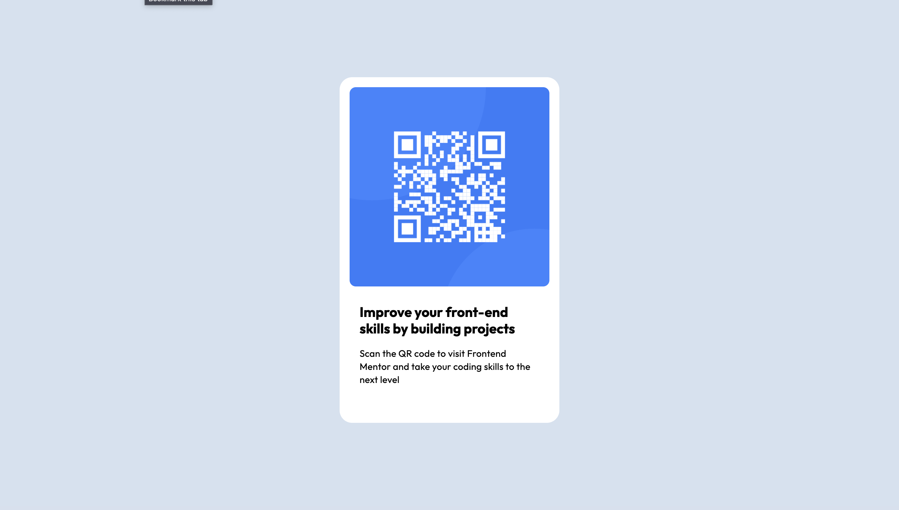

# Frontend Mentor - QR code component solution

This is a solution to the [QR code component challenge on Frontend Mentor](https://www.frontendmentor.io/challenges/qr-code-component-iux_sIO_H). Frontend Mentor challenges help you improve your coding skills by building realistic projects. 

## Table of contents

- [Frontend Mentor - QR code component solution](#frontend-mentor---qr-code-component-solution)
  - [Table of contents](#table-of-contents)
  - [Overview](#overview)
    - [Screenshot](#screenshot)
    - [Links](#links)
  - [My process](#my-process)
    - [Built with](#built-with)
    - [What I learned](#what-i-learned)

**Note: Delete this note and update the table of contents based on what sections you keep.**

## Overview

### Screenshot



### Links

- Solution URL: [https://github.com/SoutrikDas/qr-comp](https://github.com/SoutrikDas/qr-comp)
- Live Site URL: [https://soutrikdas.github.io/qr-comp/](https://soutrikdas.github.io/qr-comp/)

## My process
I was going with the idea that I would use flexbox.
At first I centered a div using two flexboxes ( body with column and the div with row )

Then At first I thought that I should add another div which would be a flexbox column , and then it would have three child items : img , text1 , text2 

Here I was a bit confused I couldnt make the Card element size properly. I gave up and went to Figma to copy the dimensions ( 499 x 320 ) 

After which I just added the proper paddings and border radius and the font. 
### Built with

- Semantic HTML5 markup
- CSS custom properties
- Flexbox


### What I learned

Initially I was using this to make distance between the image and the text : 

```html
<div class="qr">
  
</div>
<div class="text">
```
```css
img {
  height: 100%;
  width: 100%;
  border-radius: 10px;
  padding-bottom: 24px;
}
```
This was causing the Image to have rounded top corners but normal sharp bottom corners. I was confused at first but later figured out and changed it to `margin-bottom` which solved the problem


